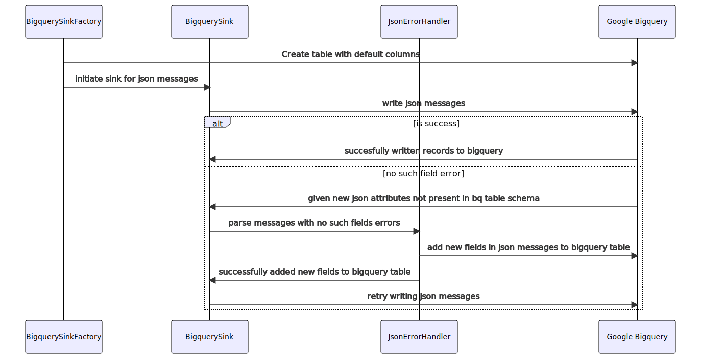

# Bigquery Sink

### Datatype Protobuf

Bigquery Sink has several responsibilities, first creation of bigquery table and dataset when they are not exist,
second update the bigquery table schema based on the latest protobuf schema,
third translate protobuf messages into bigquery records and insert them to bigquery tables.
Bigquery utilise Bigquery [Streaming API](https://cloud.google.com/bigquery/streaming-data-into-bigquery) to insert record into bigquery tables.

### Datatype JSON

Bigquery Sink has several responsibilities, first creation of bigquery table and dataset when they are not exist,
Currently we support dynamic schema by inferring from incoming json data; so the bigquery schema is updated by taking a diff of fields in json data and actual table fields.
Currently we only support string data type for fields, so all incoming json data values are converted to string type, Except for metadata columns and partion key.

## Bigquery Table Schema Update

### Protobuf

Bigquery Sink update the bigquery table schema on separate table update operation. Bigquery utilise [Stencil](https://github.com/raystack/stencil) to parse protobuf messages generate schema and update bigquery tables with the latest schema.
The stencil client periodically reload the descriptor cache. Table schema update happened after the descriptor caches uploaded.

### JSON

Bigquery Sink creates the table with initial columns mentioned in the config. When new fields arrive in json data they are added to bigquery table.

### Flow chart for data type json sink and schema update

## Protobuf - Bigquery Table Type Mapping

Here are type conversion between protobuf type and bigquery type :

| Protobuf Type                                                                      | Bigquery Type            |
| ---------------------------------------------------------------------------------- | ------------------------ |
| bytes                                                                              | BYTES                    |
| string                                                                             | STRING                   |
| enum                                                                               | STRING                   |
| float                                                                              | FLOAT                    |
| double                                                                             | FLOAT                    |
| bool                                                                               | BOOLEAN                  |
| int64, uint64, int32, uint32, fixed64, fixed32, sfixed64, sfixed32, sint64, sint32 | INTEGER                  |
| message                                                                            | RECORD                   |
| .google.protobuf.Timestamp                                                         | TIMESTAMP                |
| .google.protobuf.Struct                                                            | STRING (Json Serialised) |
| .google.protobuf.Duration                                                          | RECORD                   |

| Protobuf Modifier | Bigquery Modifier |
| ----------------- | ----------------- |
| repeated          | REPEATED          |

## Partitioning

Bigquery Sink supports creation of table with partition configuration. Currently, Bigquery Sink only supports time based partitioning.
To have time based partitioning protobuf `Timestamp` as field is needed on the protobuf message. The protobuf field will be used as partitioning column on table creation.
The time partitioning type that is currently supported is `DAY` partitioning.

## Clustering

Bigquery Sink support for creating and modifying clustering on the table. Clustering can improve the performance of certain types of queries such as queries that use filter clauses and queries that aggregate data.
When data is written to a clustered table by a query job or a load job, BigQuery sorts the data using the values in the clustering columns. These values are used to organize the data into multiple blocks in BigQuery storage.
When you submit a query that contains a clause that filters data based on the clustering columns, BigQuery uses the sorted blocks to eliminate scans of unnecessary data. You might not see a significant difference in query performance between a clustered and unclustered table if the table or partition is under 1 GB.
Follow [this](https://cloud.google.com/bigquery/docs/clustered-tables) for more details on Bigquery table clustering.

## Metadata

For data quality checking purposes, sometimes some metadata need to be added on the record.
if `SINK_BIGQUERY_ADD_METADATA_ENABLED` is true then the metadata will be added.
`SINK_BIGQUERY_METADATA_NAMESPACE` is used for another namespace to add columns
if namespace is empty, the metadata columns will be added in the root level.
`SINK_BIGQUERY_METADATA_COLUMNS_TYPES` is set with kafka metadata column and their type,
An example of metadata columns that can be added for kafka records.

## Default columns for json data type

With dynamic schema for json we need to create table with some default columns, example like parition key needs to be set during creation of the table.
Example `SINK_BIGQUERY_DEFAULT_COLUMNS =event_timestamp=timestamp`
The metadata columns are added when input data contains values for the them which will result in missing fields error and will be added by the JSON error handler.

| Fully Qualified Column Name       | Type      | Modifier |
| --------------------------------- | --------- | -------- |
| metadata_column                   | RECORD    | NULLABLE |
| metadata_column.message_partition | INTEGER   | NULLABLE |
| metadata_column.message_offset    | INTEGER   | NULLABLE |
| metadata_column.message_topic     | STRING    | NULLABLE |
| metadata_column.message_timestamp | TIMESTAMP | NULLABLE |
| metadata_column.load_time         | TIMESTAMP | NULLABLE |

## Errors Handling

The response can contain multiple errors which will be sent to the application.

| Error Name           | Generic Error Type | Description                                                                                                                             |
| -------------------- | ------------------ | --------------------------------------------------------------------------------------------------------------------------------------- |
| Stopped Error        | SINK_5XX_ERROR     | Error on a row insertion that happened because insert job is cancelled because other record is invalid although current record is valid |
| Out of bounds Error  | SINK_4XX_ERROR     | Error on a row insertion the partitioned column has a date value less than 5 years and more than 1 year in the future                   |
| Invalid schema Error | SINK_4XX_ERROR     | Error on a row insertion when there is a new field that is not exist on the table or when there is required field on the table          |
| Other Error          | SINK_UNKNOWN_ERROR | Uncategorized error                                                                                                                     |

## Google Cloud Bigquery IAM Permission

Several IAM permission is required for bigquery sink to run properly,

- Create and update Table
  - bigquery.tables.create
  - bigquery.tables.get
  - bigquery.tables.update
- Create and update Dataset
  - bigquery.datasets.create
  - bigquery.datasets.get
  - bigquery.datasets.update
- Stream insert to Table
  - bigquery.tables.updateData

Further documentation on bigquery IAM permission [here](https://cloud.google.com/bigquery/streaming-data-into-bigquery).
